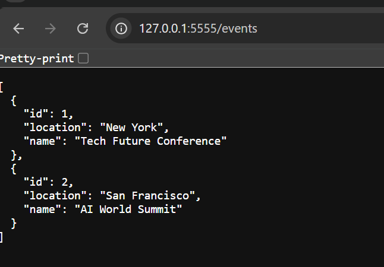
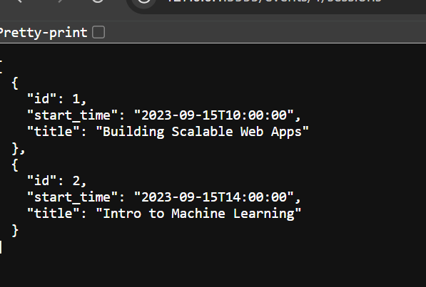
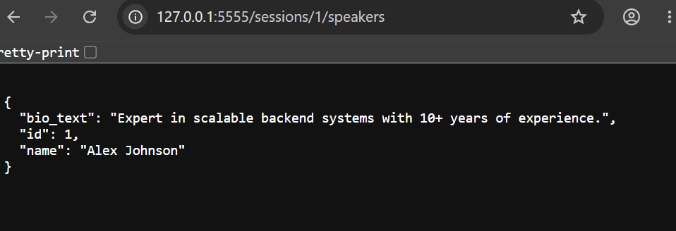
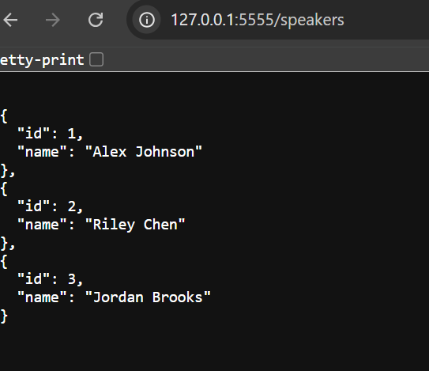
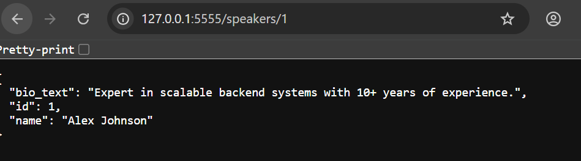

# Flask SQLAlchemy Relationships Lab

## Overview

This project demonstrates how to build and manage relationships between database models using **Flask**, **Flask-SQLAlchemy**, and **SQLAlchemy ORM**. It models an event management system where events contain sessions, speakers have biographies, and speakers can present at multiple sessions.

The application also exposes RESTful API endpoints that return JSON responses for events, sessions, and speakers.

---

## Features

* One-to-Many relationship (Event → Sessions)
* One-to-One relationship (Speaker → Bio)
* Many-to-Many relationship (Session ↔ Speaker)
* Database migrations using Flask-Migrate
* Database seeding
* RESTful JSON API
* Automated tests using Pytest

---

## Database Relationships

### Event

* Has many Sessions

### Session

* Belongs to an Event
* Has many Speakers

### Speaker

* Has one Bio
* Has many Sessions

### Bio

* Belongs to a Speaker

---

## Technologies Used

* Python
* Flask
* Flask-SQLAlchemy
* SQLAlchemy ORM
* Flask-Migrate
* SQLite
* Pytest
* Pipenv

---

## Project Structure

```text
server/
│── app.py
│── models.py
│── seed.py
│── migrations/
│── testing/
│── instance/
```

---

## Installation

Clone the repository.

```bash
git clone <your-github-repository-url>
cd flask-sqlalchemy-relationships-lab
```

Install dependencies.

```bash
pipenv install
pipenv shell
```

Navigate to the server directory.

```bash
cd server
```

Set the Flask environment variables.

```bash
export FLASK_APP=app.py
export FLASK_RUN_PORT=5555
```

---

## Database Setup

Initialize migrations.

```bash
flask db init
```

Create a migration.

```bash
flask db migrate -m "Create tables with relationships"
```

Apply the migration.

```bash
flask db upgrade
```

Seed the database.

```bash
python seed.py
```

---

## Running the Application

Start the Flask development server.

```bash
flask run
```

The application will be available at:

```text
http://127.0.0.1:5555
```

---

## API Endpoints

### Events

| Method | Endpoint                | Description                        |
| ------ | ----------------------- | ---------------------------------- |
| GET    | `/events`               | Retrieve all events                |
| GET    | `/events/<id>/sessions` | Retrieve all sessions for an event |

### Speakers

| Method | Endpoint         | Description                            |
| ------ | ---------------- | -------------------------------------- |
| GET    | `/speakers`      | Retrieve all speakers                  |
| GET    | `/speakers/<id>` | Retrieve a speaker and their biography |

### Sessions

| Method | Endpoint                  | Description                         |
| ------ | ------------------------- | ----------------------------------- |
| GET    | `/sessions/<id>/speakers` | Retrieve all speakers for a session |

---

## Testing

Run all tests using Pytest.

```bash
pytest
```

---

## Example Response

### GET `/events`

```json
[
  {
    "id": 1,
    "name": "Tech Future Conference",
    "location": "New York"
  }
]
```

---

## Screenshot

Add a screenshot of your completed application here.

```markdown





```

Create an `images/` folder in the project root and place your screenshot inside it as `screenshot.png`.

---

## Author

**Vincent**

---

## License

This project was created for educational purposes as part of a Flask SQLAlchemy Relationships Lab.
